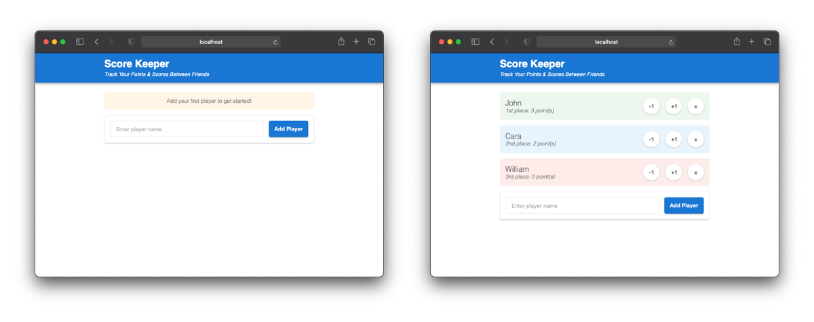

# Score Keeper

A simple score keeping web application created with Meteor, ReactJS, and MongoDB.

## Get Started

1. Download the zipfile
2. In the root directory, run `npm install`
3. After the installation is complete, run `npm start`

## Screenshots

## Frequently Asked Questions

### What is Meteor?

Meteor is an open-source isomorphic JavaScript web framework written using Node.js. Meteor is designed to build scalable web, mobile and desktop apps quickly, efficiently, and at scale.

<a href="https://www.meteor.com/" target="_blank">Learn More</a>

### What is ReactJS

React is an open-source, front end, JavaScript library for building user interfaces or UI components.

<a href="https://reactjs.org/" target="_blank">Learn More</a>

### What is MongoDB?

MongoDB is a cross-platform document-oriented database program. Classified as a NoSQL database program, MongoDB uses JSON-like documents with optional schemas.

<a href="https://www.mongodb.com/" target="_blank">Learn More</a>
